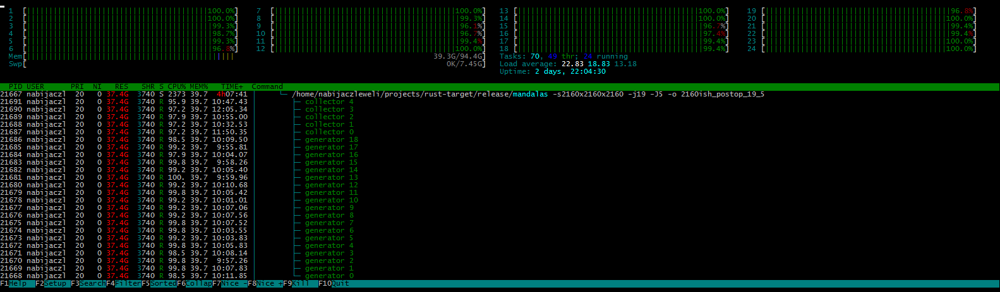
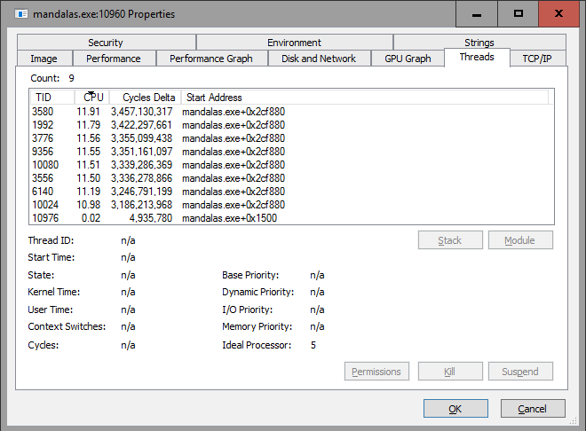
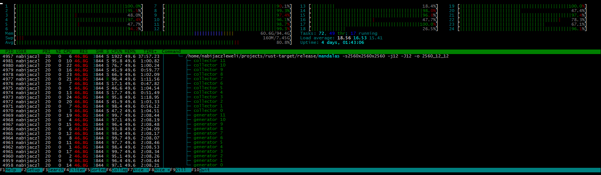
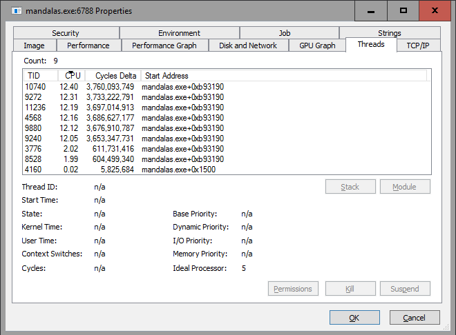
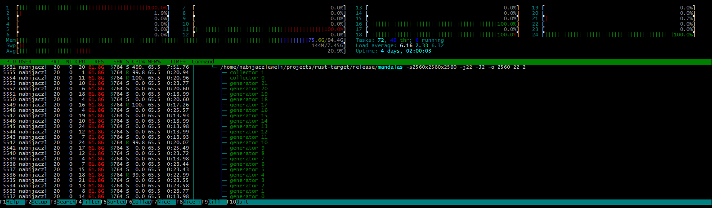

# mandalas-rs [](https://travis-ci.org/nabijaczleweli/mandalas-rs) [](https://ci.appveyor.com/project/nabijaczleweli/mandalas-rs/branch/master) [](LICENSE)
A mandala generator using Tonči Juričev-Grgin's method with a scalable driver.

## [Docs](https://rawcdn.githack.com/nabijaczleweli/mandalas-rs/doc/mandalas/index.html)
## [More](https://nabijaczleweli.xyz/content/maths/mandalas.html)
<sub>(note: That page *needs* to be rewritten; this document will be updated when that happens)</sub>

## Quick start

The `src/ops/gen_ctx.rs` file holds the actual generator, notably:
  * the cornerset around line 30, and
  * colour selection around the end of `GenerationContext::gen()`.

To generate in CMYK, one could replace the latter with
```rust
let rgb = cmyk_to_rgb([distances[0] / max, distances[1] / max,distances[2] / max, distances[3] / max]);

*self.past_positions.push_back() = (x, y, z);
((x as u32, y as u32, z as u32),
 [(rgb[0] * MAX_COLOUR).round() as u8,
  (rgb[1] * MAX_COLOUR).round() as u8,
  (rgb[2] * MAX_COLOUR).round() as u8])
```

Where `cmyk_to_rgb()` is `use`d from `mandalas::util`.

Following these changes one should be able to recompile, run `target/[buildtype]/mandalas` again,
	and see output in a colourscheme similar to [this](https://www.youtube.com/watch?list=PL3chI5PWwNA_c1nG57ittUq4op7ZmIveC&v=VBHdgqCbBec).

## Usage

For default `--jobs-*` values see [below](#driver-balancing).

Note that the output format is as many PNGs into `OUTPUT_DIR` as the third `size` dimension – this works out to roughly 1G for 900x, 4G for 1440x, and 15G for 2160x.
  (Also note that the PNGs are poorly compressed, and ca. 3G can be gained from re-encoding them in the 2160x case.)

```
P:\Rust\mandalas-rs>target\debug\mandalas -h
mandalas 0.1.0
nabijaczleweli <nabijaczleweli@gmail.com>
A mandala generator using Tonči Juričev-Grgin's method with a scalable driver

USAGE:
    mandalas [OPTIONS]

FLAGS:
    -h, --help       Prints help information
    -V, --version    Prints version information

OPTIONS:
    -J, --jobs-coll <jobs-coll>    The amount of threads to use for point collection [default: ncpus / 4]
    -j, --jobs-gen <jobs-gen>      The amount of threads to use for point generation [default: ncpus / 4 * 3]
    -o, --outdir <OUTPUT_DIR>      The directory to put the resulting mandalas in. Default: working directory
    -s, --size <size>              The output mandala resolution [default: 900x900x900]
```

## Known issues

This document will be updated as these are resolved.

1. For short/small generations, most time will be taken up by printing to console. This can be worked around by redirecting the output to a file.

## Driver tuning

The `src/main.rs` file holds the generator driver, and starts with two constants at its top —
  `QUEUE_DEPTH` sets the inter-thread buffer size (you may want to reduce this to lower memory usage in [collection-overloaded](#driver-balancing) scenarios), and
  `GENERATION_CHUNKS` governs how to divide generation into discrete chunks;
    this is not a solved problem, or, indeed, necessarily the right approach at all, and might do better if replaced with a fixed chunk size.

## Driver parallelisation

During generation, there are two distinct thread groups — generators and collectors (these are outlined explicitly at run-time on pthread platforms, see below).

Collecting is parallellised by each collector only handling one layer group – the layers whose index mod collector count match this collector's index.

This requires cooperation from the generators, and, indeed, in each chunk, the generated points are divided into as many pools as there are collectors.
This is important from a soundness perspective, as otherwise multiple references to one dummy image will be utilised
  (this is checked at runtime and a warning is emitted, should a point make its way to outside its layer group's collector).

<sub>TODO: rewrite so it makes a shred of sense?</sub>

## Driver balancing

The driver uses 3/4ths of the available CPUs for generating and the rest for collecting by default,
	as this was found to be a mostly usable ratio, but, depending on the system and generator configuration, it might not be optimal.

For the purposes of this demonstration the following systems will be used:
  * a Linux server with two six-core `Intel(R) Xeon(R) CPU           E5645  @ 2.40GHz`s, yielding 2\*6\*2=24 logical CPUs, and
  * a Windows desktop with one four-core `Intel(R) Core(TM) i7-2600 CPU @ 3.40GHz`, yielding 1\*4\*2=8 logical CPUs.

A few pseudo-benchmarks were performed on the former machine using the following command-line
```shell
GEN_J=N COLL_J=M EDGE=900 && (mkdir -p ${EDGE}_${GEN_J}_${COLL_J} && (time ~/projects/rust-target/release/mandalas -s${EDGE}x${EDGE}x${EDGE} -j$GEN_J -J$COLL_J -o ${EDGE}_${GEN_J}_${COLL_J}) 2>&1 | tee ${EDGE}_${GEN_J}_${COLL_J}.log)
```
The results were as follows:
  * `GEN_J=12 COLL_J=12`
    ```
    real    5m2.462s
    user    61m39.799s
    sys     0m48.986s
    ```
  * `GEN_J=18 COLL_J=8`
    ```
    real    4m41.392s
    user    74m49.528s
    sys     1m54.578s
    ```
  * `GEN_J=19 COLL_J=5`
    ```
    real   4m29.279s
    user   70m38.058s
    sys    0m34.649s
    ```
  * `GEN_J=8 COLL_J=18`
    ```
    real   6m35.610s
    user   60m24.894s
    sys    1m25.306s
    ```

`htop` on the Linux machine and [SysInternals Process Explorer](https://docs.microsoft.com/en-us/sysinternals/downloads/process-explorer) on the Windows machine
	were used to monitor and gather test data.

Optimally, the point generation speed matches or slightly exceeds the point consumption speed, such that each thread never sleeps, i.e. it fully loads the CPU it's running on.
This situation is illustrated below:
  * 19 generation threads, 5 collection threads
    
  * 7 generation threads, 1 collection thread
    

If there are too many collector threads, the following might happen:
  * 12 generation threads, 12 collection threads – in this particular case, the collector threads oscillated at about 0.2-0.3Hz between 0% and 100%
    
  * 6 generation threads, 2 collection threads
    

If there aren't enough collector threads, the following might happen:
  * 22 generation threads, 2 collection threads – also note the increased memory usage from the buffers being full
    
  * 2 generation threads, 6 collection threads
    

## Special thanks

To all who support further development on Patreon, in particular:

  * ThePhD
